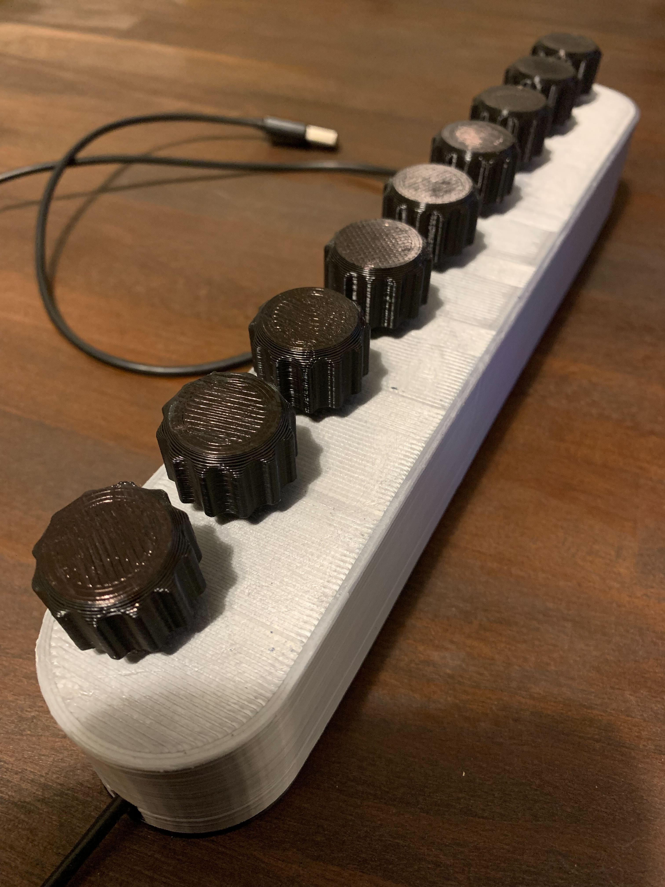

# DrewBoard
MIDI Control

- 8 Rotary Encoders programmed as MIDI dials and reset buttons
- 1 Rotary Encoder crippled because the pico only has 8 PIOs, so it can be used as one button when rotated (either direction) and one button when pressed.

