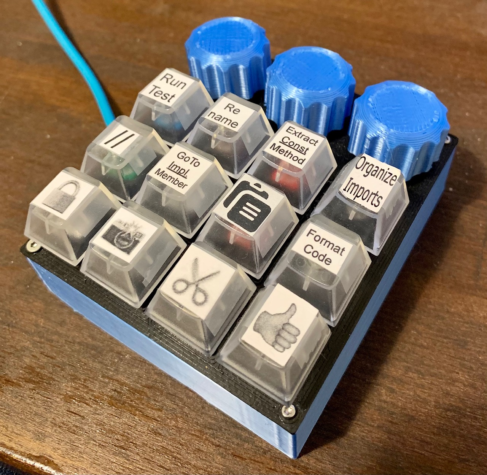

# API
## Button
Takes the GPIO pin as input. Allows the registration of 3 functions:
1. Down: invoked when the button is pressed
1. ShortUp: invoked when the button is depressed in less than 10 cycles
1. LongUp: (optional) invoked when the button is depressed in more than 10 cycles

## Encoder
Takes the GPIO pins of the encoder and allows the registration of two functions.
One triggered on left turn and the other on right turns.

## Dial
This is specific to a MIDI controller. It takes the GPIO pins of the encoder's left, right & button and the MIDI channel numbers for the dial position and for the button trigger. 

# Boards
## GeoBoard
Configurable Keyboard Shortcuts with:
- 12 key Cherry MX Switch Tester
- 3 Rotary Encoders

The code starts in [GeoBoard.py](GeoBoard.py), which should be renamed to `code.py`.

### Development Board

### Final MacroKeyboard

## DrewBoard
MIDI Control
- 9 Rotary Encoders
