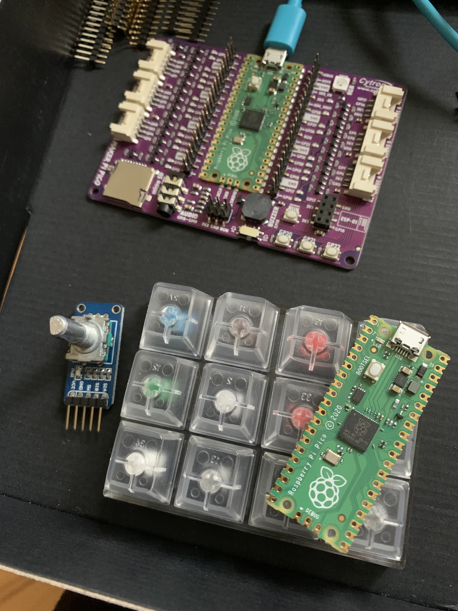
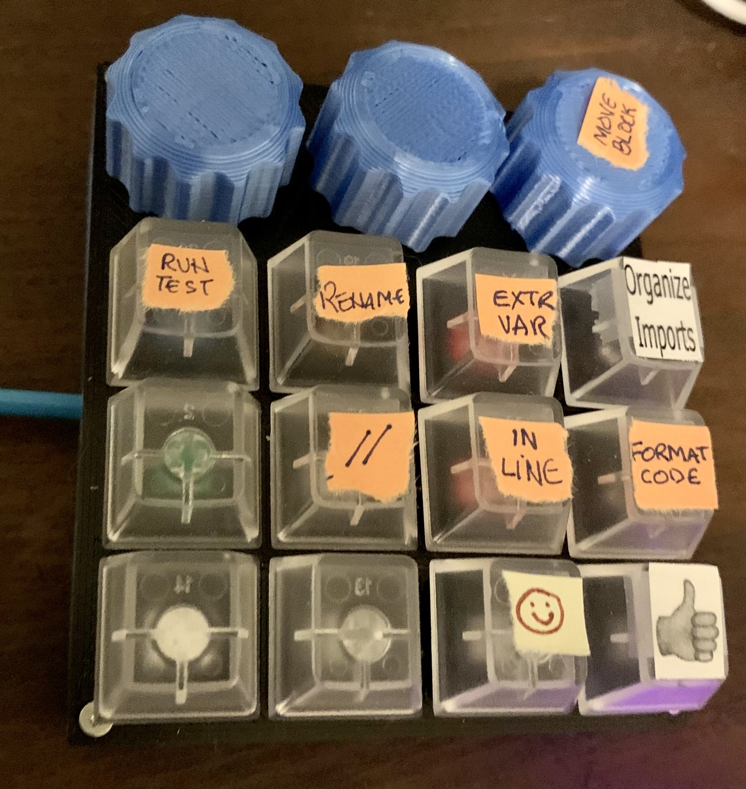

# MacroKeyboard
- Based on a Raspberry Pi Pico
- 12 key Cherry MX Switch Tester
- 3 Rotary Encoders
- 3D Printed case & knobs

The code starts in [code.py](code.py)

Each button supports keys to send on down, up and long up.

## Development Board

## Final MacroKeyboard

