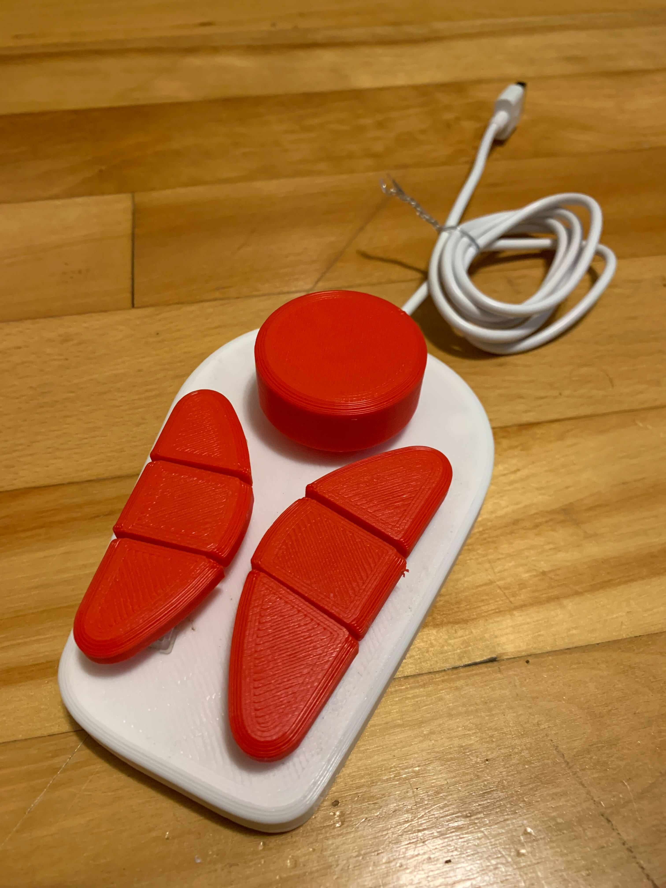

# rpi-pico
Collection of CircuitPython scripts for my Raspberry Pi Pico projects

## [GeoBoard](GeoBoard/README.md)


## [DrewBoard](DrewBoard/README.md)


## [InteleBoard](InteleBoard/README.md)


## [shared](shared/README.md)

# Installation
1. Download CircuitPython for Raspberry Pi Pico from [here](https://circuitpython.org/board/raspberry_pi_pico/)
2. Plug in the new Raspberry Pi Pico and drop the downloaded uf2 file onto the mounted drive
3. Download Adafruit's extra library bundle from [here](https://circuitpython.org/libraries)
4. Unzip it and copy `lib/adafruit_hid` to the `lib` folder of the Pico
5. Copy `code.py` and all files in the `shared` folder to the root of the Pico

# Debuging
1. Recommended editor: [Mu Editor](https://codewith.mu/en/download) ([full Adafruit Tutorial](https://learn.adafruit.com/getting-started-with-raspberry-pi-pico-circuitpython/overview))
2. Open a python file directly from the Pico
3. Edit the file
4. Press the `Check`👍 toolbar button to verify your code compiles
5. Open the `Serial`↔️ pannel
6. Save the edited file

# Example Encoders
[Keycode API Reference](https://circuitpython.readthedocs.io/projects/hid/en/latest/api.html#adafruit-hid-keycode-keycode)

## IntelliJ IDEA Move Code Block
```python
    Encoder(
        "IDEA Move Block Up/Down",
        board.GP0, board.GP1,  # Replace with your GPIO pin numbers
        send(Keycode.CONTROL, Keycode.SHIFT, Keycode.UP_ARROW),
        send(Keycode.CONTROL, Keycode.SHIFT, Keycode.DOWN_ARROW),
    ),
    Button(
        "IDEA Select More",
        board.GP22,  # Replace with your GPIO pin number
        send(Keycode.CONTROL, Keycode.W)
    ),
```

## IntelliJ IDEA Debugging
```python
    Encoder(
        "IDEA Debugging",
        board.GP4, board.GP5,  # Replace with your GPIO pin numbers
        send(Keycode.SHIFT, Keycode.F8),  # Turn left: Step out of
        send(Keycode.F8),  # Turn right: Step over
    ),
    Button(
        "IDEA Debugging Step Into",
        board.GP6,  # Replace with your GPIO pin number
        send(Keycode.F7),  # Press button: Step into
    )
```

## IntelliJ IDEA Find Next & Prev
```python
    Encoder(
        "IDEA Search & Find Next",
        board.GP2, board.GP3,  # Replace with your GPIO pin numbers
        send(Keycode.SHIFT, Keycode.F3),
        send(Keycode.F3),
    ),
    Button(
        "Search",
        board.GP7,  # Replace with your GPIO pin number
        send(Keycode.CONTROL, Keycode.F),
    ),
```

## Change OS Workspaces
```python
    Encoder(
        "Linux Change Workspace",
        board.GP2, board.GP3,  # Replace with your GPIO pin numbers
        send(Keycode.ALT, Keycode.CONTROL, Keycode.LEFT_ARROW),
        send(Keycode.ALT, Keycode.CONTROL, Keycode.RIGHT_ARROW),
    ),
    Button(
        "Linux Tile Windows",
        board.GP6,  # Replace with your GPIO pin number
        send(Keycode.COMMAND),  # Press button: Tile Windows
    )
```

# Example Buttons
## IntelliJ IDEA Re-run Test
```python
    Button(
        "IDEA Run Test",
        board.GP8,  # Replace with your GPIO pin number
        send(Keycode.CONTROL, Keycode.F5),
    ),
```

## IntelliJ IDEA Comment line
```python
    Button(
        "IDEA Comment",
        board.GP9,  # Replace with your GPIO pin number
        send(Keycode.CONTROL, Keycode.FORWARD_SLASH),
    ),
```

## IntelliJ IDEA Organize Imports
```python
    Button(
        "IDEA Organize Imports",
        board.GP17,  # Replace with your GPIO pin number
        send(Keycode.CONTROL, Keycode.ALT, Keycode.O),
    ),
```

## IntelliJ IDEA Reformat Code
```python
    Button(
        "IDEA Reformat Code",
        board.GP18,  # Replace with your GPIO pin number
        send(Keycode.CONTROL, Keycode.ALT, Keycode.L),
    ),
```

## Linux Lock Screen
```python
    Button(
        "Linux Lock Screen",
        board.GP10,  # Replace with your GPIO pin number
        send(Keycode.COMMAND, Keycode.L),
    ),
```

## Slack Thumbs Up 👍 (Typing Example)
```python
    Button(
        "Slack Thumbs Up",
        board.GP19,  # Replace with your GPIO pin number
        write(":+1: "),  # KeyDown
        send(Keycode.CONTROL, Keycode.ENTER),  # KeyUp
    )
```

## Copy and Cut (Long Press & NoOp Example)
```python
    Button(
        "OS Copy/Cut",
        board.GP16,
        noOp,  # KeyDown -> nothing
        send(Keycode.CONTROL, Keycode.C),  # KeyUp (Short) -> copy
        send(Keycode.CONTROL, Keycode.X),  # KeyUp (Long) -> cut
    ),
```

## Emacs Save & Exit (Sequence Example)
```python
    Button(
        "Emacs Save & Close",
        board.GP19,  # Replace with your GPIO pin number
        sequence(,  # KeyDown -> Save
            send(Keycode.CONTROL, Keycode.X),
            send(Keycode.CONTROL, Keycode.S),
        ),
        sequence(,  # KeyUp -> Exit
            send(Keycode.CONTROL, Keycode.X),
            send(Keycode.CONTROL, Keycode.C),
        ),
    )
```
